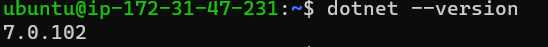
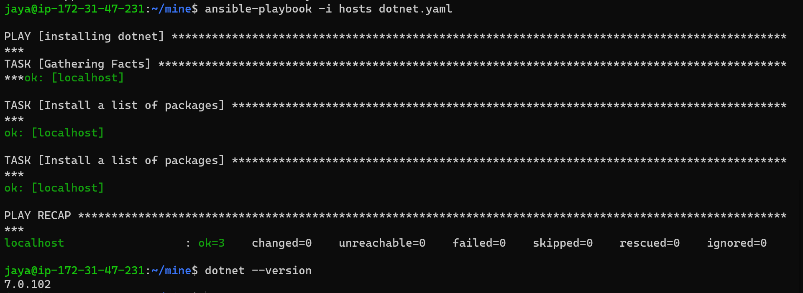

Installing Dotnet on ubuntu
----------------------------

* manual steps
```
wget https://packages.microsoft.com/config/ubuntu/22.10/packages-microsoft-prod.deb -O packages-microsoft-prod.deb
sudo dpkg -i packages-microsoft-prod.deb
sudo apt update
sudo apt-get install -y dotnet-sdk-7.0
sudo apt-get install -y aspnetcore-runtime-7.0
sudo apt-get install -y dotnet-runtime-7.0
```


## ansible playbook

[refer here](https://github.com/jayainjeti/mine/blob/main/dotnet.yaml)

* result
