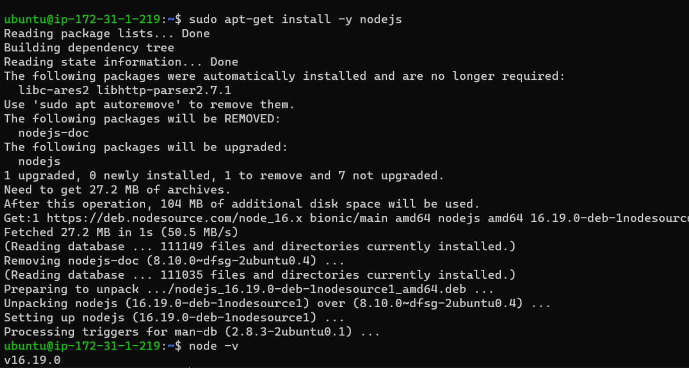

Installing nodejs on ubuntu
----------------------------

* manual steps
```
curl -sL https://deb.nodesource.com/setup_16.x -o /tmp/nodesource_setup.sh
sudo bash /tmp/nodesource_setup.sh
sudo apt update
sudo apt install nodejs
```
* To verify nodejs version use ` node -v `




## ansible playbook

[refer here](https://github.com/jayainjeti/mine/blob/main/nodejs/nodejs.yaml)

* result
